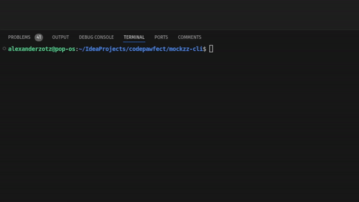
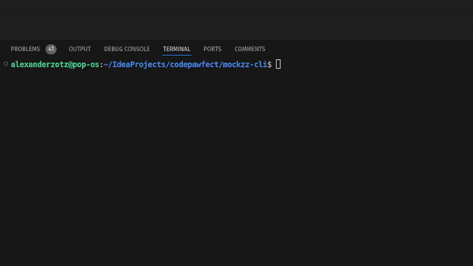

<div style="text-align: center;">
  <h1>
    Introducing a leightweight Go API-Mock Server managed via CLI
  </h1>
</div>

Mockzz-CLI is a command-line tool that enables users to easily create and manage mock APIs along with their associated responses.

### Why Would I use this?

- Easy to set up and install
- Leightweight, interactiv CLI and fast

## Table of Contents

- [Usage Example](#usage-example)
- [Install](#install)
- [License](#license)

## Usage Example
#### Add new mock APIs super easy


#### Manage your APIs with ease


#### Run your mock server with a single command


change server port with:
```bash
mockzz start -p 8090
```
or
```bash
mockzz start --port 8090
```

## Install
### Option 1: Using Prebuilt Binary
Download the Prebuilt Binary: Download the binary artifact for your system from the releases page from this Repository.

Move Binary to Your PATH: Move the binary to a directory that is included in your system's PATH. This allows you to run mockzz from any location in your terminal.
```bash
sudo mv mockzz /usr/local/bin/
```

### Option 2: Build binary from Source
Install Go: Make sure you have Go installed (version 1.23.0 or later).
Clone the Repository: Clone the source code repository from GitHub.
```bash
git clone https://github.com/CodePawfect/mockzz-cli.git
cd mockzz-cli
```

Build the Binary: Use the Go build tool to create the binary:
```bash
go build -o mockzz
```

Move Binary to Your PATH: Move the generated mockzz binary to a directory in your PATH, so it can be used globally.
```bash
sudo mv mockzz /usr/local/bin/
```

## License
Licensed under [MIT License](./LICENSE.txt)
